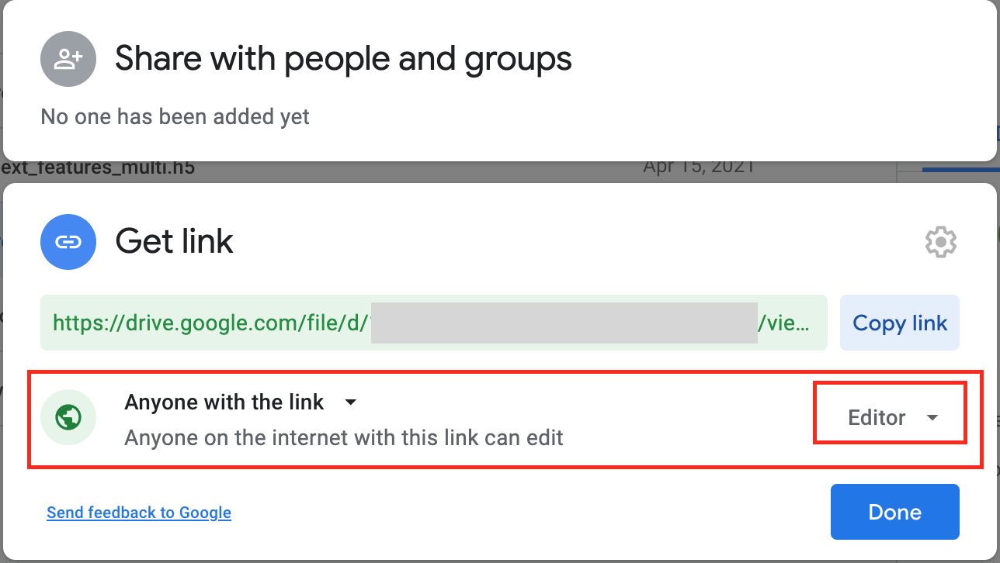

# gdriveget
Automatically download Google Drive files (on Linux). 

## Usage
1. Set the access of the file to ***Anyone** on the internet with this link can **edit***.



2. Run the command on Linux machine: 
```
./gdirveget.sh "<FILE_LINK>" <SAVE_PATH>
```
The two arguments are required. Remember to add *""* around the link.

## Explanation
Typically, you can download a google drive file by the command `wget https://drive.google.com/uc?export=download&id=FILEID`. However, for large files and binary files this does not work, because it pops up a "Can't scan file for viruses" window. So you need to get the real download link from the virus warning html page, which contains a code generated by the cookie. 

## Related tools
 - [PyDrive](https://github.com/googleworkspace/PyDrive)
 - [PyDrive2](https://github.com/iterative/PyDrive2)
